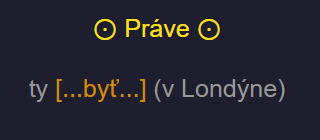
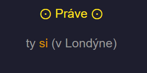
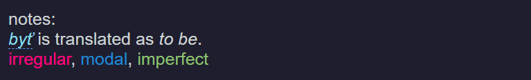
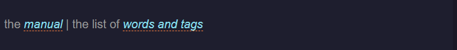
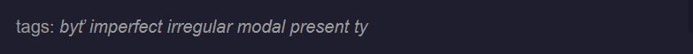
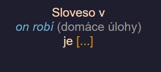
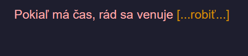

# Manual

<!-- TOC -->
* [Manual](#manual)
  * [English](#english)
    * [What is in this deck](#what-is-in-this-deck)
    * [Anatomy of a Flashcard](#anatomy-of-a-flashcard)
    * [A Guide to Verbal and Visual Cues](#a-guide-to-verbal-and-visual-cues)
    * [How to Pace the Study?](#how-to-pace-the-study)
    * [Tags & Filtering](#tags--filtering)
    * [List of the 35 Verbs](#list-of-the-35-verbs)
    * [Deck Description](#deck-description)
    * [Conjugation Resources](#conjugation-resources)
<!-- TOC -->

## English

In my opinion, this manual is a **Must-Read** to make the most out of it and learn everything properly. 
You're going to spend somthing about 4 months in it.
So I kindly ask you to spend some of your time right now to understand how everything works.

Before we start, here is where things are:

- Install the deck from [AnkiWeb](https://ankiweb.net/shared/info/652653707) or [this file](%5BShared%5D%20Ultimate%20Slovak%20Conjugation.apkg) here, on GitHub.
- To use it, you need to install either [AnkiDroid](https://play.google.com/store/apps/details?id=com.ichi2.anki&hl=en) (Android),
[Anki Desktop](https://apps.ankiweb.net/) (Windows | Mac | Linux),
or [AnkiMobile](https://apps.apple.com/us/app/ankimobile-flashcards/id373493387) (iOS).
- You can help in improving this deck or fixing errors here, on [GitHub](https://github.com/Enkidu-Chains/Ultimate-Slovak-Conjugation).

### What is in this deck

**35 Verbs, 800 Flashcards**<br>
The deck has 811 conjugation flashcards. Most of the 35 verbs have 24 flashcards.
You'll find a list of the 35 verbs below.
There's also a separate page explaining in detail how the verbs were selected.

**Are the conjugations accurate?**<br>
For the most part. I used different sources to retrieve the conjugations, they will be mentioned later. 
Also, other parts may have some bugs to fix, so if you find them,
please, make the issue on [GitHub](https://github.com/Enkidu-Chains/Ultimate-Slovak-Conjugation/issues).
Or contribute to the project by fixing it yourself on [GitHub](https://github.com/Enkidu-Chains/Ultimate-Slovak-Conjugation).

**What are 24 cards for most verbs?**<br>
- infinitive - 1 card
- verbal noun -  1 card
- participles (masculine singular only) -  3 cards
- present tense - 6 cards
- past tense - 4 cards
- future tense - 6 cards (only for byť)
- imperative tense - 3 cards
- reminder cards - 6 card

**Why these particular 35 verbs?**<br>
Picking these verbs wasn't very hard proces.
The most of the work had been already done by the time I was searching for verbs.
[Here](https://slovake.eu/learning/grammar/classes%2Fverbs) is the site I used to find 14 verbs for base patterns
and 6 modal verbs. And these three [1](http://www.slovnik.org/ru/Ucebnica/Table-04.html),
[2](https://en.wiktionary.org/wiki/Category:Slovak_irregular_verbs)
and [3](https://forum.wordreference.com/threads/slovak-irregular-verbs.2766504/) for irregular verbs.

**Compound tenses and reminder cards**<br>
This deck includes compound tenses: 
- future (compound only for imperfect verbs)
- past (only 6 forms)
- past perfect
- present conditional
- past conditional
- imperative (only two forms)

The mechanism of making them is quite easy to remember so learning them is just rehashing of already learnt forms.
Therefore, they are separated to riminder cards that comes after main set of cards.<br>
You can suspend or remove these card if you don't want to learn them, or already know how to make compound tenses.
It will decrease amount of card to 604 card.
(Warning about future tense, it can be either compound tense or present tense forms for imperfect and perfect verb respectively.
With exception to *byť*, it has its own future tense form.)

### Anatomy of a Flashcard

This section walks you through the various components that can be found on a flashcard. 
(Even though I haven't made flashcards very informative)

**The Prompt**<br>
The prompt is the front side of the card.



- The verb to conjugate appears `[...in brackets...]`
- Here the phrase `Práve` and the eye bulb `⊙` alert you that the tense to use is the *present*.

**The Answer**<br>
The top part of the 'back' of the card shows the answer.



**Verbs in the Same Family (NOT IMPLEMENTED)**<br> 
The next section shows how other verbs in the same 'family' (conjugation group) conjugate in the same person and tense.
This makes it easier to see how the pattern works.

**Notes**<br>
Notes shows the translation of a verb to English, and some attributes (regular/irregular, modal, perfect/imperfect).
It is not a low of information, be it may be useful. Also, if you click no the infinitive form of a verb in notes,
it will lead you to this [site](https://slovnik.juls.savba.sk/) to look up a verb in different Slovak dictionaries.



**Link to this Manual and the List of Verbs and Tags**<br>
Each card has a small link to this manual,
just in case you need to quickly consult the list of tags or the number of cards in the next verb, for instance.



**Tags**<br>
The very bottom of the card shows you all the tags that are attached to it.
These tags enable advanced students to filter a range of cards they would like to review.



### A Guide to Verbal and Visual Cues

This section guides you through the verbal and visual "shortcuts" that are meant to make your studying faster and easier.

**1. Infinitive**<br>
Prompts for the infinitive have a verbal cue:<br>
`Sloveso v on (conjugated form) je...`



This card is prompting for *robiť*.

**2. Verbal noun**<br>
Prompts for the verbal noun have a verbal cue:<br>
`Pokiaľ má čas, rád sa venuje`



This card is prompting for *robenie*.

**3. Participle**<br>
All participles are in masculine singular form only because this deck is not about how to change gender in adjectives.

All prompts for the participles have visual cue:<br>
`Človek`

- Present active participle<br>
Prompts for the present active participle have a verbal cue:<br>
`Dnes, on je ... človek`<br><br>
<br><br>
This card is prompting for *robiaci*.<br><br>

- Past active participle<br>
Prompts for the past active participle have a verbal cue:<br>
`Človek ... tu a tam, má niečo`<br><br>
<br><br>
This card is prompting for *robivší*.<br><br>

- Past passive participle<br>
Prompts for the past passive participle have a verbal cue:<br>
`Tento človek je ...`<br><br>
<br><br>
This card is prompting for *robený*.<br><br>

**4. Present**<br>
Cards in present tense have:
- a verbal cue: `Práve`
- a visual cue: the bull's eye symbol `⊙`


This card is prompting for *robíš*.

**5. Past**<br>
Cards in present tense have:
- a verbal cue: `V tom čase často,`
- a visual cue: the left arrow `←`


This card is prompting for *robil*.

6. Past perfect**<br>
Cards in present tense have:
- a verbal cue: `Pred týmto časom,`
- a visual cue: the left arrow plus the down arrow `←↧`


This card is prompting for *bola robila*.

**7. Future**<br>
Cards in present tense have:
- a verbal cue: `V budúcnosti,`
- a visual cue: the right arrow `→`


This card is prompting for *budeme robiť*.

**8. Present conditional**<br>
Cards in present tense have:
- a verbal cue: `Keby sa to stalo,`
- a visual cue: the elipsis plus the bull's eye `…⊙` 


This card is prompting for *robili by ste*.

**9. Past conditional**<br>
Cards in present tense have:
- a verbal cue: `Pred týmto časom, keby sa to bolo stalo,`
- a visual cue: the elipsis plus the left arrow `…←`


This card is prompting for *boli by ste robili*.

**10. Imperative**<br>
Cards in present tense have:
- a verbal cue: `prosím`
- a visual cue: the exclamation point `!`


This card is prompting for *rob*.

**The negative cards**<br>
There are no negative cards in this deck because they are formed by simply attaching the suffix `ne` to a verb.
(To the auxiliary verb if there is any.) In case with present tense `byť` form you just put `ne` before it `'ne som'`
Also ísť have irregular negative form, you replace `i` at the beginning with `ne` in all forms. 

**Reminder cards**<br>
They are six forms of past tense, two forms of imperative tense and all forms of
past perfect, future (except of `byť`), present conditional, past conditional tenses

### How to Pace the Study?

If you're an advanced student, please skip to the [Tags & Filtering](#tags--filtering) section.

If you're starting out and would like to complete the deck in about four months, here are the study patterns I recommend.

**1. New cards: on demand, not automatic, not random**<br>
You need to be in charge of when you start studying new verbs.
For this reason, the number of new cards to be shown each day is set to zero.
It's up to you to request new cards, as outlined below.

Before anything else, here's how to add cards in Anki.
The number 39 is for you first start the deck, as there are 28 cards for the first verb.

`Click or long-press deck name → Custom Study → Increase today's new card limit → 28`

In the deck's options, the cards are shown in their order in the deck (not random),
and that's important in order to learn one verb at a time when you see it the first time — otherwise your head will explode!

Furthermore, before adding new cards,
I recommend you clear your review queue for the day — meaning,
bring the green and red numbers to zero by studying all the cards in the queue.
Then you add the new cards (usually an entire verb),
and for that first pass you can focus on the new material without having Anki mix it with your review cards.

**2. Study every day**<br>
If you don't know Anki, you only need to know one thing:
unless you're willing to study every day, don't even get started — it won't work.
This system relies on staying on top of your review queue,
and if you skip even a day, the backlog will discourage you: you'll soon quit.

**3. First month: six verb, one verb every 5 days**<br>
In the first month, the aim is to complete the first 6 verbs: byť, mať, robiť, vidieť, ísť and chcieť.

**Important for Month One: When you add cards, draw a number of new cards that corresponds to full logical units.**

If you can handle it, add one entire verb at a time.
It might be hard at first, but when you start to get the patterns, you'll find that very comfortable.

As a reminder, here is how you would add the 22 cards for the verb *mať* after completing the *byť* cards:

`Click or long-press deck name → Custom Study → Increase today's new card limit → 58`

If you're going to split a verb, at least try not to split a tense in two — for instance,
add all six cards of the present tense.
It may be hard to know how many cards to add for the verbal noun, the participle, the imperative (in two verbs)
and the reminder (in three verbs) because they may inconsistent number of cards.

These are the number of cards per logical block:
- infinitive - 1 card
- verbal noun - 0 or 1 card
- participles - 0 to 3 cards
- present tense - 6 cards
- past tense - 4 cards
- future tense - 6 cards (only for byť)
- imperative tense - 1 to 3 cards
- reminder cards - 5 to 6 cards (compound tenses, remember, you can suspend these cards if you already know how to make
compound tenses, and you don't want to study them here.)

**4. Months Two to Four: one verb every three days**<br>
After the first month, try to introduce a full verb every three days or so.
If you have to go to four days, don't sweat it, you'll still complete the deck in about five months.

Before adding the next verb, Thou shalt check its number of cards

IMPORTANT: before adding a verb, you MUST check how many forms it has,
so that you can add the correct number of new cards.

Here are some ways to check the number of cards of the next verb:
- Consult the list of 35 verbs on this page.
- On Ankidroid, long-press the deck's name, select 'Options',
tap Deck description at the bottom for the full list (scrollable).
- On Anki for Windows / Mac / Linux, tap the cog wheel to the right of the deck's name,
select 'Options', select the 'Description' tab.
- I don't have the iOS version (AnkiMobile) but I'm sure it's similar.

**5. A note about deck options**<br>
Even if you have downloaded the deck from AnkiWeb, my set of recommended deck options may not have carried over. Here are the options I recommend for this deck.

Anki version > 2.1.46 (the option menu changed then)
- New cards per day: 0
- Maximum reviews per day: 200
- Learning steps: 2m 15m 1d 4d 10d
- Graduating interval: 30
- Easy interval: 4
- Insertion order: sequential
- Lapses: 15m 1 9999 Tag only
- Maximum answer seconds: 40
- Burying: both unchecked
- Advanced: 1826 2.50 1.30 1.00 1.20 0.00

Anki version < 2.1.46 (the option menu was different back then)
- New cards: steps = 2 15 1440 5760 14400, order = new cards in order added, new cards/day = 0, graduating interval = 30, easy interval = 4, starting ease = 250%
- Reviews: maximum = 200, easy bonus = 130%, interval modifier = 100%, maximum interval = 1826
- Lapses: steps = 15, new interval = 0%, minimum interval = 1 day, leech threshold = 9999, leech action = tag only
- General: max answer time = 40 seconds, show answer timer

(WARNING, never use hard or easy button, never ever)

### Tags & Filtering

Although this is not how I recommend beginners use the deck, if you're an advanced student at times you may want to focus your study on a specific section of the deck. To do so, you can create filtered decks using the tags below.

Tags for filtered decks can be combined. Here are useful links: [browsing](https://docs.ankiweb.net/browsing.html),
[filtered decks](https://docs.ankiweb.net/filtered-decks.html), [searching](https://docs.ankiweb.net/searching.html).

[Here](List%20of%20Tags.md) is the full list of tags.

**1. By Subject**<br>
tag:ja
tag:ty
tag:on
tag:ona
tag:ono
tag:my
tag:vy
tag:oni
tag:ony

**2. By Tense**<br>
tag:infinitive
tag:verbal_noun
tag:present_active_participle
tag:past_active_participle
tag:past_passive_participle
tag:present
tag:past
tag:past_perfect
tag:future
tag:present_conditional
tag:past_conditional
tag:imperative

**3. By Slovak Verb Name**<br>
tag:byť
tag:mať
tag:robiť
tag:vidieť
... and so on (see full list of verbs below)

**4. By Attribute**<br>
tag:regular
tag:irregular
tag:modal
tag:perfect
tag:imperfect

**5. Misc**<br>
tag:reminder
tag:feminine
tag:masculine

### List of the 35 Verbs

The deck has 811 conjugation cards.

For reference, here is the list of the 35 verbs in the deck, they are sorted by frequency (according to ChatGPT).

01. Byť (to be): 28 cards
02. Mať (to have): 22 cards
03. Robiť (to do): 24 cards
04. Vidieť (to see): 24 cards
05. Ísť (to go): 24 cards
06. Chcieť (to want): 24 cards
07. Vedieť (to know): 24 cards
08. Jesť (to eat): 24 cards
09. Stať (to stand): 22 cards
10. Nájsť (to find): 24 cards
11. Môcť (to be able to): 21 cards
12. Vziať (to take): 22 cards
13. Dostať (to get): 24 cards
14. Musieť (to have to): 21 cards
15. Povedať (to tell): 23 cards
16. Pracovať (to work): 24 cards
17. Smieť (to be allowed to): 17 cards
18. Predpovedať (to predict): 23 cards
19. Pomôcť (to help): 21 cards
20. Báť (to fear): 20 cards
21. Brať (to take): 23 cards
22. Rozumieť (to understand): 24 cards
23. Trieť (to rub): 24 cards
24. Žuť (to chew): 24 cards
25. Chytať (to catch): 24 cards
26. Česať (to comb): 24 cards
27. Žať (to reap): 24 cards
28. Prísť (to arrive): 23 cards
29. Stáť (to cost): 24 cards
30. Hynúť (to perish): 24 cards
31. Dôjsť (to come): 23 cards
32. Pôjsť (to go): 23 cards
33. Kričať (to scream): 24 cards
34. Niesť (to carry): 23 cards
35. Chudnúť (to lose weight): 24 cards

### Deck Description
When publishing the Deck to Ankiweb, the Description contained by my deck options does not appear in the deck you download.
That's a shame, but apparently for the time being that's an Anki feature, not a bug.

If you'd like to add the deck the description I intended, which is handy because it contains the list of verbs and tags,
I recommend you paste the following in the description field of the deck options:
- In Anki desktop, options are accessed via the cogwheel to the right of the deck's name. Select the *Description* tab and paste.
- On Ankidroid, options are accessed by long-pressing the deck's name and selecting *Options*. Navigate to the bottom and paste.

**Description to Paste in Anki:**
```
1. Remember to read the MANUAL!
2. To filter the deck by tense, subject or verb, skip to the bottom.

Here is the list of verbs. The numbers tell you how many cards to add when you're ready for a new verb.
01. Byť (to be): 28 cards
02. Mať (to have): 22 cards
03. Robiť (to do): 24 cards
04. Vidieť (to see): 24 cards
05. Ísť (to go): 24 cards
06. Chcieť (to want): 24 cards
07. Vedieť (to know): 24 cards
08. Jesť (to eat): 24 cards
09. Stať (to stand): 22 cards
10. Nájsť (to find): 24 cards
11. Môcť (to be able to): 21 cards
12. Vziať (to take): 22 cards
13. Dostať (to get): 24 cards
14. Musieť (to have to): 21 cards
15. Povedať (to tell): 23 cards
16. Pracovať (to work): 24 cards
17. Smieť (to be allowed to): 17 cards
18. Predpovedať (to predict): 23 cards
19. Pomôcť (to help): 21 cards
20. Báť (to fear): 20 cards
21. Brať (to take): 23 cards
22. Rozumieť (to understand): 24 cards
23. Trieť (to rub): 24 cards
24. Žuť (to chew): 24 cards
25. Chytať (to catch): 24 cards
26. Česať (to comb): 24 cards
27. Žať (to reap): 24 cards
28. Prísť (to arrive): 23 cards
29. Stáť (to cost): 24 cards
30. Hynúť (to perish): 24 cards
31. Dôjsť (to come): 23 cards
32. Pôjsť (to go): 23 cards
33. Kričať (to scream): 24 cards
34. Niesť (to carry): 23 cards
35. Chudnúť (to lose weight): 24 cards

Altough this is not how I recommend beginners use the deck, if you're an advanced student at times you may want to focus your study on a specific section of the deck. To do so, you can create filtered decks using the tags below.

Tags for filtered decks can be combined. Here are useful links: [browsing](https://docs.ankiweb.net/browsing.html),
[filtered decks](https://docs.ankiweb.net/filtered-decks.html), [searching](https://docs.ankiweb.net/searching.html).


Here is the full list of tags.

1. By Subject
tag:ja
tag:ty
tag:on
tag:ona
tag:ono
tag:my
tag:vy
tag:oni
tag:ony

2. By Tense
tag:infinitive
tag:verbal_noun
tag:present_active_participle
tag:past_active_participle
tag:past_passive_participle
tag:present
tag:past
tag:past_perfect
tag:future
tag:present_conditional
tag:past_conditional
tag:imperative

3. By Slovak Verb Name
tag:byť
tag:mať
tag:robiť
tag:vidieť
... and so on (see full list of verbs below)

4. By Attribute
tag:regular
tag:irregular
tag:modal
tag:perfect
tag:imperfect

5. Misc
tag:reminder
tag:feminine
tag:masculine

```

### Conjugation Resources
- https://labs.juls.savba.sk/
- https://slovake.eu/learning/grammar/classes%2Fverbs
- https://www.logosconjugator.org/
- http://www.slovnik.org/ru/Ucebnica/Table-04.html
- https://www.verbix.com/languages/slovak
